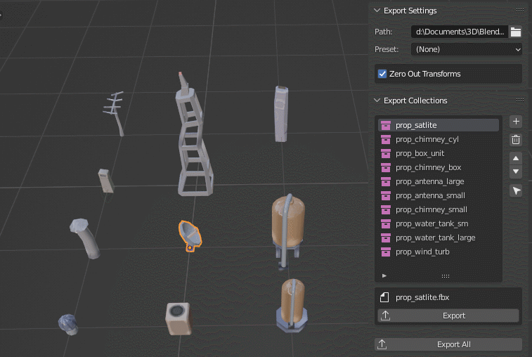

JAMTools Export Manager

A simple tool for remembering and automating exporting of FBX files, per collection. Remembers the path and makes exporting multiple assets effortless. 
 
 

- Export instantly, no thinking needed! Just set up your exports once and export any time. Allows for rapid iterations and updates between prorams.
- Zero Out Transforms - An option for moving objects to origin position on export, so you can keep your objects arranged anywhere.
- Never have to worry about selecting the right collection, path or filename again, with easy 1-click exports. 
- Presets can be applied, but the default (None) works well for props/environment art.
- Export All to export everything easily.
- Supports relative paths.
- Similar to Game Tools export in MODO

Usage:

How to Install:
Download Code as zip, and in Blender's Add-on Preferences use 'Install' and locate the zip (or extract to a 'JAMTools' folder to your addons folder).

How to Add a Collection:

On the Export panel, Click the '+' button under Export Collections. Add your collection. Click export any time to export.

 
 
 This tool was made for my own usage mostly, I've been using it for several years now, tested on Windows & Linux. Has not been tested in the wild by anyone else yet.
 
  Known Limitations / To Do : 
 
 - Only one export path is currently possible per .blend file. I may add per-collection path overrides.
 - Last used preset is not current saved
 - Only FBX format is supported, it's all I've needed so far (Exporting for Unity, Unreal, Houdini, 3DCoat, Substance)
 
